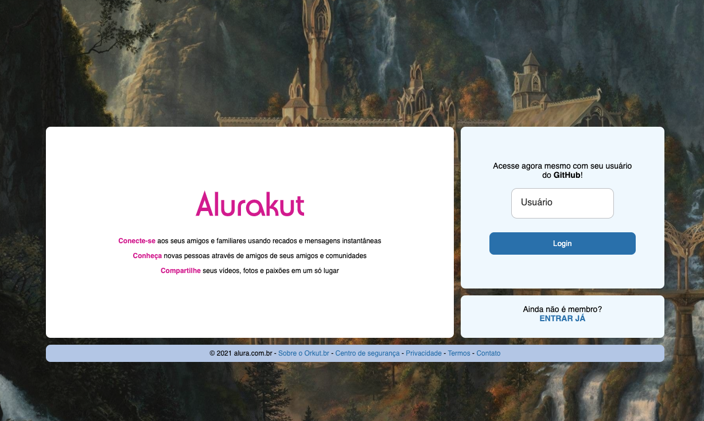
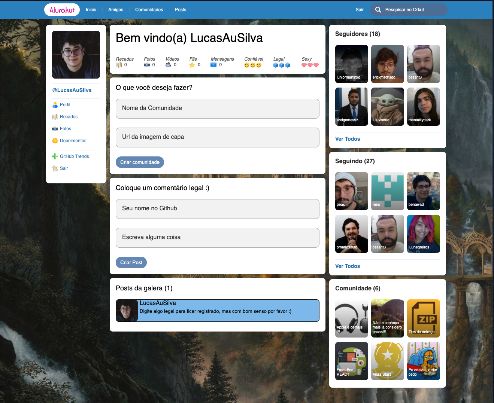

# Alurakut

> Project development in the imersão alura react 3, where we create a new orkut with NextJS, and using DatoCMS as database and back-end.

  

## Versioning

---

This project doesn't have versioning.

## History

---

Check [Releases](https://github.com/LucasAuSilva/alurakut/releases) for details.

## Features

---

### Login

> Use your github username for login the application and see your followers and follow.
> 

### Posts

> Comments your tooths about the application in the post section.
> The application doesn't support different post for different users.
> 

## License

---

[MIT](https://github.com/LucasAuSilva/alurakut/blob/main/LICENSE)
